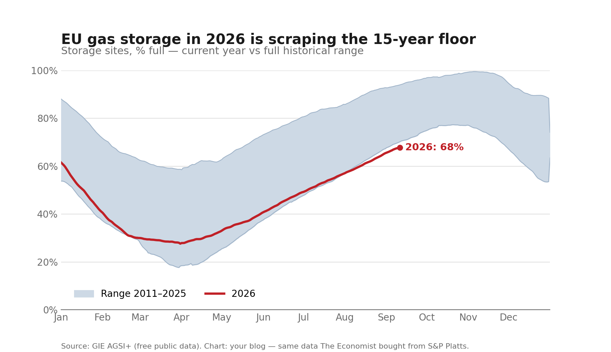

```{=html}
<div class="title-bar">
  <h2>The refill season, measured</h2>
  <p>Under EU regulations, member states must reach 90% storage ahead of winter. Heading into autumn, inventories are trailing the entire 15-year historical record.</p>
</div>
```

```{=html}
<div class="insight-strip">
  <div class="insight-item">
    <div class="insight-value">67.8%</div>
    <div class="insight-label">Current EU Storage (Sep 11)</div>
  </div>
  <div class="insight-item">
    <div class="insight-value">767 TWh</div>
    <div class="insight-label">Gas in Storage</div>
  </div>
  <div class="insight-item">
    <div class="insight-value">70.2%</div>
    <div class="insight-label">15-Yr Low on Sep 11 (2021)</div>
  </div>
  <div class="insight-item">
    <div class="insight-value">94.0%</div>
    <div class="insight-label">15-Yr High on Sep 11 (2019)</div>
  </div>
</div>
```

Europe's plan for winter energy security relies on filling underground salt caverns and depleted gas fields during the mild summer months. Under the EU Gas Storage Regulation—originally enacted as Regulation (EU) 2022/1032 and extended through 2027 by Regulation (EU) 2025/1733 amending Regulation (EU) 2017/1938—member states face a binding legal obligation to reach **90% storage capacity** ahead of winter. For 2026, the updated framework sets the target window between 1 October and 1 December.

This summer, the refill has lagged. Across the entire 15-year daily record published by Gas Infrastructure Europe (GIE AGSI+), European storage facilities have never entered mid-September with storage levels this low.

```{=html}
<div class="finding-box">
On September 11, 2026, European gas storage stood at <strong>67.8% full</strong> (767 TWh). The previous 15-year low for that calendar date was <strong>70.2%</strong>, recorded in 2021.
</div>
```

```{=html}

```

## Why 2026 is lagging

The daily AGSI+ data shows that 2026's deficit is inherited from its spring starting point, rather than a failure of summer injections:

1. **A deeper spring trough:** European inventories bottomed at a seasonal low of 27.6% on March 31—27.8 points below 2023's 55.4% and 30.9 points below 2024's 58.5%.
2. **A normal refill pace that could not bridge the opening gap:** Between the March 31 trough and September 11, European storage gained 40.2 percentage points. That injection gain matches historical summer refill paces (+38.2 points over the same period in 2023, +34.7 in 2024, +38.6 in 2020, and +41.1 in 2021). Because the refill ran at normal rather than emergency injection rates (unlike the extraordinary +58.4-point push in 2022), the ~28-point deficit inherited from the spring remained intact heading into autumn.

Storage is still rising—inventories climbed from 54.0% on July 19 to 67.8% in mid-September—but the refill window closes as the withdrawal season begins.

---

## Data & Provenance

The chart uses official, daily aggregate data from **Gas Infrastructure Europe (GIE AGSI+)**:

- **Series:** Aggregated Gas Storage Inventory (EU Total, `type=EU`).
- **Span:** 5,733 daily records, January 1, 2011 through September 11, 2026.
- **Fetch date:** September 12, 2026.
- **Licence & attribution:** Mandatory attribution: *Source: GIE AGSI+*.

Many media visualisations rely on commercial feeds (such as S&P Global Platts). AGSI+ publishes the same underlying operational reports directly from European storage facility operators, free and open to the public.
