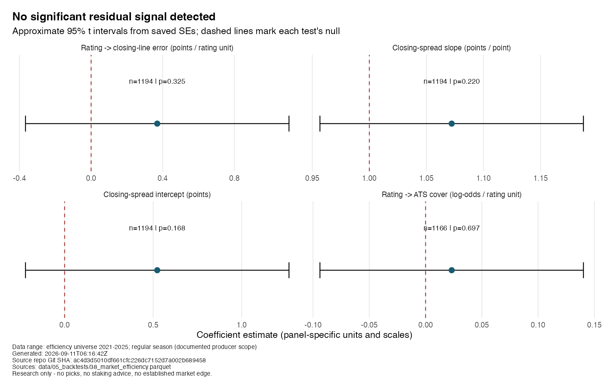
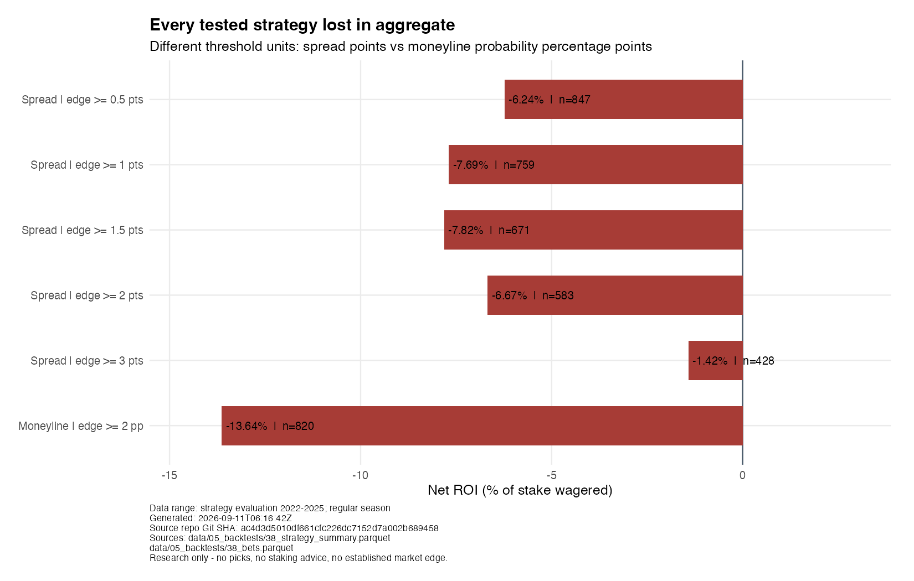

::: {.callout-important}
## The finding
The real closing-line backtest detects **no significant residual signal** from
our power index. **All six tested strategies lost in aggregate net of vig** over
the saved strategy-evaluation seasons. These results do not support staking money.
:::

## A football story is not a market advantage

The index starts with a reasonable football question: can a team's efficiency,
physicality, and situational tendencies help explain its strength? EPA—expected
points added—summarises the change in scoring expectation produced by a play.
The composite combines offensive and defensive EPA with schematic proxies such
as stuffed runs, long third downs, personnel usage, and four-man pressure.

Those ingredients can make a useful descriptive ranking. To establish an edge,
however, the ranking must say something the closing line does not already price.
The title refers to that economic comparison: it is **not** a claim that this
article directly compares the power index and the market on Brier score.

The index uses hand-set weights and constructed tier labels, not observed or
validated Bootleg Football ratings. The saved descriptive rankings include the
current game. The backtest producer instead rebuilds lagged ratings and fits
rating-to-margin and rating-to-win-probability mappings using earlier seasons
only. This publication reads the resulting backtest artifacts; it does not
rebuild either ratings or models.

## Put the market's error on the scoreboard

The first test asks whether the home-minus-away rating differential explains
actual home margin minus the closing spread. If the index contains information
missing from the close, its coefficient might differ from zero. The saved
estimate does not clear that test.

Two further coefficients examine closing-spread calibration: the intercept's
null is **zero**, while the slope's null is **one**. A fourth test relates the
rating differential to covering the spread. Testing every coefficient against
zero would answer the wrong question for the calibration slope.

{fig-alt="Four faceted coefficient plots. Every approximate 95 percent interval crosses its dashed test-specific null; labels report sample sizes and p-values."}

```{r}
#| echo: false
#| results: asis
cat(readLines("../../_generated/efficiency.qmd"), sep = "\n")
```

The regression universe covers regular seasons **2021–2025**, including the
initial season that is training-only for strategy evaluation. The ATS test drops
pushes, so it has fewer observations. These are retrospective efficiency tests,
not an additional held-out forecasting contest.

The plot reconstructs approximate 95% intervals from the saved, rounded standard
errors using the producer's t reference with `n - 2` degrees of freedom, including
its logistic row. These are ordinary model standard errors, not team- or
season-clustered errors. The panel scales and coefficient units differ.

**Failing to reject the null is not proof that the market is universally
efficient.** It means these tests did not detect the proposed signal in this
sample. It does not rule out smaller effects, other features, other markets, or
future changes.

## After the bookmaker's margin, every aggregate strategy loses

The economic test evaluates five absolute spread-edge thresholds and one
fractional-Kelly moneyline rule. Strategy outcomes cover **2022–2025**; 2021
supplies initial training history and is never bet.

{fig-alt="Horizontal bars show negative aggregate net ROI for five spread-edge thresholds and one moneyline strategy. Bet counts are printed beside each bar."}

```{r}
#| echo: false
#| results: asis
cat(readLines("../../_generated/strategies.qmd"), sep = "\n")
```

Spread rules use a one-unit stake at an **assumed fixed −110 price**. The closing
spread is real; that fixed spread price is an assumption, not a historical
book-by-book price series. The implementation excludes pushes from both the bet
ledger and ROI denominator. ROI is profit divided by recorded stake, not a
compounded bankroll return.

The moneyline rule uses saved offered closing odds, proportional no-vig
probabilities for the edge comparison, quarter-Kelly sizing, and a 5% per-bet
stake cap. Its threshold is a probability difference, not spread points; the
chart labels those units separately. Its reported ROI is also profit divided by
stake, not a simulated season's bankroll percentage change.

The less-negative threshold is not a discovered winner. Threshold samples
overlap and were compared on the same historical period. Some individual
strategy-seasons were profitable; the claim is about each strategy's **aggregate**
result. The chart shows observed returns, not confidence intervals or forecasts
of future losses. No live execution, liquidity, or line-shopping advantage is
demonstrated.

## A promising feature block is still an unresolved result

A separate calibrated XGBoost experiment asks whether schematic features add
predictive value beyond baseline EPA. Negative Brier deltas favour the full
model. Both saved point estimates are negative, but both paired-bootstrap
intervals cross zero:

```{r}
#| echo: false
#| results: asis
cat(readLines("../../_generated/incremental.qmd"), sep = "\n")
```

These are game-paired percentile intervals from 2,000 bootstrap resamples.
Split A tests 2024–2025; split B tests 2025, so the test windows overlap—they
are not independent replications. The schematic block is **directionally better,
not established at 95%**. Feature importance is not causal evidence, and it is
not a substitute for an out-of-sample improvement.

## The result worth publishing

The portfolio achievement is a research question answered without turning an
interesting football feature into an unsupported market claim. The next credible
step would require new, genuinely held-out evidence and a pre-specified test,
not selecting whichever historical threshold looks least bad.

Historical opening-line and CLV findings are excluded entirely: their old openers
were synthetic. `R/11_scrape_opening_lines.R` now refuses to run. Invalid input
cannot be rehabilitated with an attractive result or a small-sample caveat.

::: {.callout-note collapse="true"}
## Artifact fingerprints

```{r}
#| echo: false
#| results: asis
cat(readLines("../../_generated/manifest.qmd"), sep = "\n")
cat("\n\n")
cat(readLines("../../_generated/source-manifest.qmd"), sep = "\n")
```
:::
