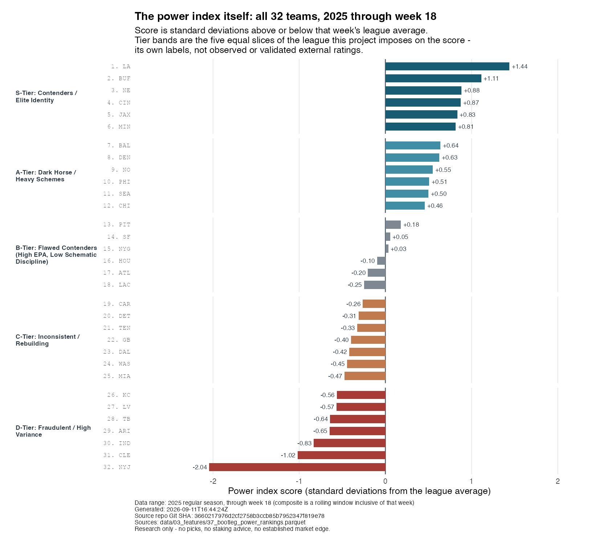

::: {.callout-important}
## The finding
The real closing-line backtest detects **no significant residual signal** from
my power index. **All six tested strategies lost in aggregate net of vig** over
the saved strategy-evaluation seasons. These results do not support staking money.
:::

## What the power index is

Every week, the index gives each of the 32 NFL teams a single number for how
well it has been playing. Four ingredients go into that number.

The largest is **efficiency**. The measure behind it is EPA — expected points
added. Before every play, you can work out how many points a team is likely to
score on the drive from where it is standing. EPA is the change in that number
once the play is over: a first-down conversion is worth positive EPA, a sack is
worth negative EPA. Averaged over a season, it separates teams that move the
ball from teams that only look busy.

The other three ingredients are descriptive colour about *how* a team plays:
how often it stuffs opposing runs, how often it faces long third downs, what
personnel it puts on the field, and how much pressure it generates with four
rushers. Each ingredient is put on a common scale before the four are combined,
and the weights are set by hand rather than fitted to anything.

The score is then expressed in **standard deviations from that week's league
average** — zero is an ordinary team, +1 is a strong one, −1 a poor one. The
five tier bands are simply the league cut into fifths by that score, with one
override that moves a high-efficiency, low-discipline team down a band. **The
tier names are this project's own vocabulary, imposed on the composite. They
are not ratings that were measured against any outside source, and nothing here
was fitted to or validated against external tier labels.**

## What the index says right now

{fig-alt="Horizontal bar chart of all 32 NFL teams ranked by power index score for the 2025 season through week 18, faceted into five tier bands from S-Tier at the top to D-Tier at the bottom. Scores run from about +1.44 to −2.04 standard deviations from the league average."}

```{r}
#| echo: false
#| results: asis
cat(readLines("../../_generated/power-index.qmd"), sep = "\n")
```

That is a perfectly reasonable descriptive ranking. It is also where most
football content stops — and where the actual question starts.

## The benchmark this has to beat

A betting market publishes a **closing line**: the final price on a game just
before kickoff, after everyone who wanted to bet it has bet it. For a point
spread, that is the handicap the market settled on — how many points the
favourite has to win by. The closing line is the sharpest public summary of a
game that exists, because money has been pushing it around all week.

So a ranking being *sensible* proves nothing. To establish an edge, it has to
say something the closing line does not already price. The title refers to that
economic comparison: it is **not** a claim that this article directly compares
the power index and the market on Brier score.

::: {.callout-note collapse="true"}
## How the tested ratings differ from the ranking above (no-lookahead detail)

The chart above is the descriptive form of the index, and it includes the
current game — that is what a "how good has this team looked so far" ranking
should do. It would be cheating to feed that to a model predicting the same
game.

The index uses hand-set weights and constructed tier labels, not observed or
validated external ratings. The saved descriptive rankings include the current
game. The backtest producer instead rebuilds lagged ratings and fits
rating-to-margin and rating-to-win-probability mappings using earlier seasons
only. This publication reads the resulting backtest artifacts; it does not
rebuild either ratings or models.
:::

## Test one: does the index know anything the closing line missed?

If the index holds information the market has not priced, then the games where
it most disagrees with the closing line should be the games the closing line
gets most wrong. That is the first test: take the index's home-minus-away
rating gap, and see whether it explains the difference between the real result
and the closing spread.

It does not. The estimated relationship is statistically indistinguishable from
nothing — and the same is true of three further tests run alongside it.

{fig-alt="Four faceted coefficient plots. Every approximate 95 percent interval crosses its dashed test-specific null; labels report sample sizes and p-values."}

Each panel shows one estimate and the range of values still consistent with the
data, against the dashed line marking what that test would look like if there
were nothing to find. In all four, the dashed line sits inside the range.

Two of those four coefficients ask whether the closing spread is **calibrated** —
whether it lands on the real margin on average, rather than running
consistently high or low. A perfectly calibrated line has an intercept of
**zero**, meaning no constant bias in either direction, and a slope of **one**,
meaning a one-point move in the spread goes with a one-point move in the real
margin. So the intercept is tested against zero and the slope against one.
Testing the slope against zero would instead ask whether the closing spread
predicts the margin *at all* — the wrong question here. The fourth test relates
the rating gap to whether a team covered the spread, which is the
**against-the-spread (ATS)** result: not who won the game, but who beat the
handicap.

**Failing to reject the null is not proof that the market is universally
efficient.** It means these tests did not detect the proposed signal in this
sample. It does not rule out smaller effects, other features, other markets, or
future changes.

::: {.callout-note collapse="true"}
## The coefficient table, and how the intervals were built

Every estimate, its null, its interval and its p-value:

```{r}
#| echo: false
#| results: asis
cat(readLines("../../_generated/efficiency.qmd"), sep = "\n")
```

The regression universe covers regular seasons **2021–2025**, including the
initial season that is training-only for strategy evaluation. The ATS test drops
**pushes** — games that land exactly on the line, where the bet is refunded
rather than won or lost — so it has fewer observations. These are retrospective
efficiency tests, not an additional held-out forecasting contest.

The plot reconstructs approximate 95% intervals from the saved, rounded standard
errors using the producer's t reference with `n - 2` degrees of freedom, including
its logistic row. These are ordinary model standard errors, not team- or
season-clustered errors. The panel scales and coefficient units differ.
:::

## Test two: would betting on it have made money?

The statistical test is the strict one. The economic test is the one people
actually care about: if you had bet every game where the index disagreed with
the closing line by more than some amount, what would have happened?

Six versions of that rule were tried — five thresholds on the point spread, and
one on the moneyline, the straight win-loss price. **All six lost money in
aggregate**, after the bookmaker's cut.

{fig-alt="Horizontal bars show negative aggregate net ROI for five spread-edge thresholds and one moneyline strategy. Bet counts are printed beside each bar."}

```{r}
#| echo: false
#| results: asis
cat(readLines("../../_generated/strategies.qmd"), sep = "\n")
```

Strategy outcomes cover **2022–2025**; 2021 supplies initial training history and
is never bet. Spread rules use a one-unit stake at an **assumed fixed −110
price** — the standard bookmaker's charge of risking 110 to win 100. The closing
spread is real; that fixed spread price is an assumption, not a historical
book-by-book price series. The implementation excludes pushes from both the bet
ledger and ROI denominator. ROI is profit divided by recorded stake, not a
compounded bankroll return.

The least-negative threshold is not a discovered winner. Threshold samples
overlap and were compared on the same historical period. Some individual
strategy-seasons were profitable; the claim is about each strategy's **aggregate**
result. The chart shows observed returns, not confidence intervals or forecasts
of future losses. No live execution, liquidity, or line-shopping advantage is
demonstrated.

::: {.callout-note collapse="true"}
## How the moneyline rule was sized

The moneyline rule uses saved offered closing odds, proportional no-vig
probabilities for the edge comparison, quarter-Kelly sizing, and a 5% per-bet
stake cap. Its threshold is a probability difference, not spread points; the
chart labels those units separately. Its reported ROI is also profit divided by
stake, not a simulated season's bankroll percentage change.
:::

## One question that is still open

A separate experiment asked a narrower version of the same thing: do the
schematic ingredients add anything on top of plain EPA when predicting who wins?
The answer leans yes but does not clear the bar — both point estimates favour
the fuller model, and both uncertainty ranges still include "no difference."

::: {.callout-note collapse="true"}
## The incremental-value result in full

A separate calibrated XGBoost experiment asks whether schematic features add
predictive value beyond baseline EPA. Negative Brier deltas favour the full
model. Both saved point estimates are negative, but both paired-bootstrap
intervals cross zero:

```{r}
#| echo: false
#| results: asis
cat(readLines("../../_generated/incremental.qmd"), sep = "\n")
```

These are game-paired percentile intervals from 2,000 bootstrap resamples.
Split A tests 2024–2025; split B tests 2025, so the test windows overlap—they
are not independent replications. The schematic block is **directionally better,
not established at 95%**. Feature importance is not causal evidence, and it is
not a substitute for an out-of-sample improvement.
:::

## The result worth publishing

The portfolio achievement is a research question answered without turning an
interesting football feature into an unsupported market claim. The next credible
step would require new, genuinely held-out evidence and a pre-specified test,
not selecting whichever historical threshold looks least bad.

Historical opening-line and CLV findings are excluded entirely: their old openers
were synthetic. `R/11_scrape_opening_lines.R` now refuses to run. Invalid input
cannot be rehabilitated with an attractive result or a small-sample caveat.

::: {.callout-note collapse="true"}
## Artifact fingerprints

```{r}
#| echo: false
#| results: asis
cat(readLines("../../_generated/manifest.qmd"), sep = "\n")
cat("\n\n")
cat(readLines("../../_generated/source-manifest.qmd"), sep = "\n")
```
:::

[Methodology and limitations](../../methodology.qmd) · [Artifact provenance](../../artifacts.qmd)
