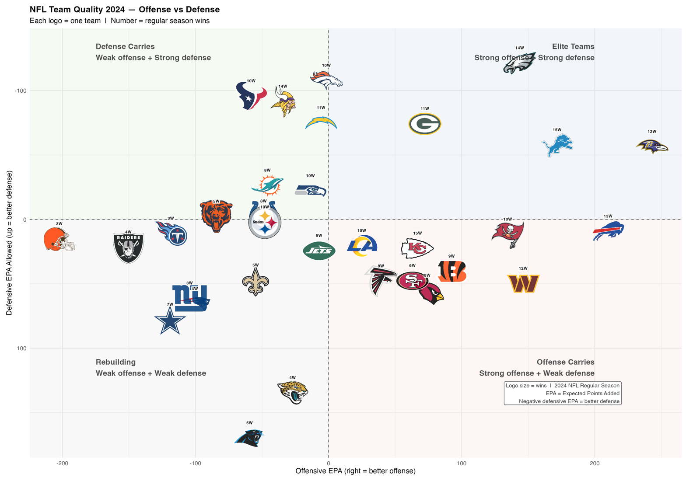

```{=html}
<div class="title-bar">
  <h2>NFL Analytics Research</h2>
  <p>Evaluating 5 seasons (2021–2025) of play-by-play data to classify team identities and measure what drives wins.</p>
</div>

<div class="insight-strip">
  <div class="insight-item">
    <div class="insight-value">50.1%</div>
    <div class="insight-label">Pass Offense Win Impact</div>
  </div>
  <div class="insight-item">
    <div class="insight-value">0.748</div>
    <div class="insight-label">Model R² (CV RMSE 1.60W)</div>
  </div>
  <div class="insight-item">
    <div class="insight-value">160</div>
    <div class="insight-label">Team-Seasons Evaluated</div>
  </div>
  <div class="insight-item">
    <div class="insight-value">9</div>
    <div class="insight-label">Distinct Archetypes</div>
  </div>
</div>
```

---

## The Question

Every NFL broadcast praises teams for "establishing the run" or "imposing their physical will." But down-by-down statistical modeling consistently reveals that passing generates far more Expected Points Added (EPA) than rushing. 

Does heavy rushing volume build winning football teams, or is it an illusion? Evaluating all ~65,000 plays per season across 160 team-seasons (2021–2025) reveals a clear taxonomy.

```{=html}
<div class="finding-box">
  <strong>The Core Finding:</strong> Rushing is a <strong>multiplier, not a foundation</strong>. Teams with an <em>Elite Run Identity</em> (like the 2024–2025 Buffalo Bills) succeed because opposing defenses are terrified of their quarterback's deep ball — opening light defensive boxes. Teams that run without an elite passing threat simply run themselves into 3rd-and-long.
</div>
```

---

## The Interactive Efficiency Map

Hover over any team logo to see their Wins, Offensive EPA, Defensive EPA, Rush EPA, and Identity Classification:

{width="100%" fig-align="center"}

---

## The Four Operational Quadrants

By plotting **Total Pass EPA** on the x-axis against **Total Rush EPA** on the y-axis, the NFL splits into four distinct profiles:

### 1. The True Contenders — Dual-Threat Efficiency
* **Archetypes:** *Elite Run Identity* / *Elite Offense — Pass Drives It*
* **Key Teams:** Buffalo Bills (+99.2 Pass EPA, +56.7 Rush EPA), Detroit Lions, Baltimore Ravens.
* **The Math:** These teams generate positive EPA on both running and passing downs. Their running backs face lighter defensive boxes because defenses cannot afford to stack 8 defenders against Josh Allen or Lamar Jackson.

### 2. The Pure Aerial Gunslingers — Pass Dominates, Run Fails
* **Archetypes:** *Good Offense Despite Run Game* / *Complementary Rushing*
* **Key Teams:** LA Rams (+164.1 Pass EPA, +14.8 Rush EPA), Green Bay Packers (+127.6 Pass EPA, −12.8 Rush EPA).
* **The Math:** Rushing is neutral or negative, but their passing explosive rate (≥15 yards) is so potent that they overcome rushing stalls to produce double-digit win seasons.

### 3. Surviving on the Ground — Positive Rushing, Toothless Passing
* **Archetype:** *Surviving On The Run*
* **The Math:** Teams leaning on running backs to hide developmental quarterbacks. While rush EPA may look positive in isolation, they collapse on 3rd-and-long when defenses crowd the line of scrimmage.

### 4. The Broken Ground Game — Ineffective Everywhere
* **Archetypes:** *Run Identity — Broken* / *Struggling Offense*
* **Key Teams:** Carolina Panthers (−19.3 Pass EPA, −8.5 Rush EPA), Atlanta Falcons (−2.9 Pass EPA, −17.1 Rush EPA).
* **The Math:** Running for 2 yards on 1st-and-10 puts the offense behind the chains, inviting predictable passing situations that defenses easily disrupt.

---

## What the Win Model Confirms

Regressing team win totals against four EPA phases (R² = 0.748, CV RMSE = 1.60 wins):

| Phase | Relative Weight | Strategic Takeaway |
|---|---|---|
| **Pass Offense EPA** | **50.05%** | Passing explains half of all NFL win variation |
| **Pass Defense EPA Allowed** | **23.07%** | Pass rush + coverage is defense's primary lever |
| **Rush Offense EPA** | **20.79%** | Rushing multiplies wins once the pass threat is established |
| **Rush Defense EPA Allowed** | **6.09%** | Run-stopping alone has virtually no correlation with championships |

---

## How the Groups Are Actually Drawn

This is the part most team-archetype pieces skip, so here it is in full. **No clustering algorithm was used.** The groups are hand-drawn thresholds on empirical quartiles from the 160 team-seasons in the sample:

| Cut | Rule | Where the number comes from |
|---|---|---|
| Elite offence | `pass_epa_per_play >= 0.0810` | 75th percentile, 2021–2025 |
| Poor offence | `pass_epa_per_play < -0.0902` | 25th percentile, 2021–2025 |
| Elite defence | `def_composite >= 0.0546` | 75th percentile, 2021–2025 |
| Poor defence | `def_composite < -0.0444` | 25th percentile, 2021–2025 |

where `def_composite = -(0.8 × pass EPA allowed + 0.2 × rush EPA allowed)`, sign-flipped so higher is better. The 80/20 weighting mirrors the win model below — pass defence matters roughly four times more than run defence.

The seven archetypes are then just the cells of a 3×3 grid of offence tier × defence tier, with the two thinnest cells merged.

```{=html}
<div class="finding-box">
  <strong>Where this is weak, stated plainly:</strong> a team one point either side of a
  quartile cut gets a different label, and quartiles are relative — in a season where
  every offence improves, a quarter of teams are still stamped "Poor." Hard cuts also
  hide the interesting cases: a team sitting exactly between Contender and Pretender
  gets forced into one, and you never see that it was a coin flip.
</div>
```

**I tried to fix it with clustering, and failed.** The plan was a Gaussian mixture model over the same features, so each team would get a *probability* of membership — "2025 Ravens: 61% Contender, 33% Pretender" instead of a hard bucket. Four separate tests said there is nothing to cluster: the gap statistic and BIC both choose a single group, and at seven groups the weakest cluster's bootstrap stability is 0.41.

NFL team-seasons form one continuous cloud, not seven islands. The full write-up, with the diagnostics, is here: **[I Tried to Cluster NFL Teams. There Are No Clusters.](../no-clusters/index.qmd)**

That result does not invalidate the taxonomy below — it reframes it. These are labels imposed on a continuum for the sake of talking about teams quickly, not groups discovered in the data. Which is exactly why every threshold is printed above rather than hidden behind an algorithm.

---

## The Takeaway

"Running the ball" is not a strategy — it is an endgame tool available to teams that have already won the passing war.

When evaluating matchups, don't ask who has the bigger running back. **Look at their quadrant on the EPA map.** The data will tell you what the team actually is, regardless of what their head coach says in Tuesday's press conference.

---

::: {.callout-note}
## Explore All 32 Teams
Every franchise's dossier — four-phase EPA bars on one shared scale, quarterback rolling form, lead-back creation metrics, and the 2026 projection — is generated straight from the pipeline in [All 32 Teams](../../teams/index.qmd). Nothing on those pages is typed by hand.
:::
