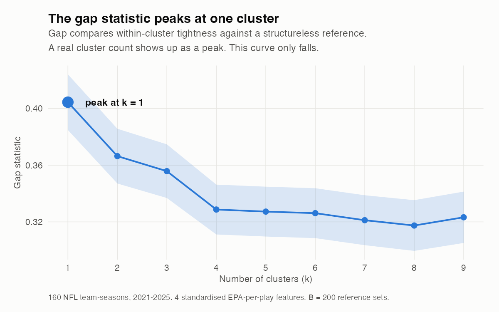
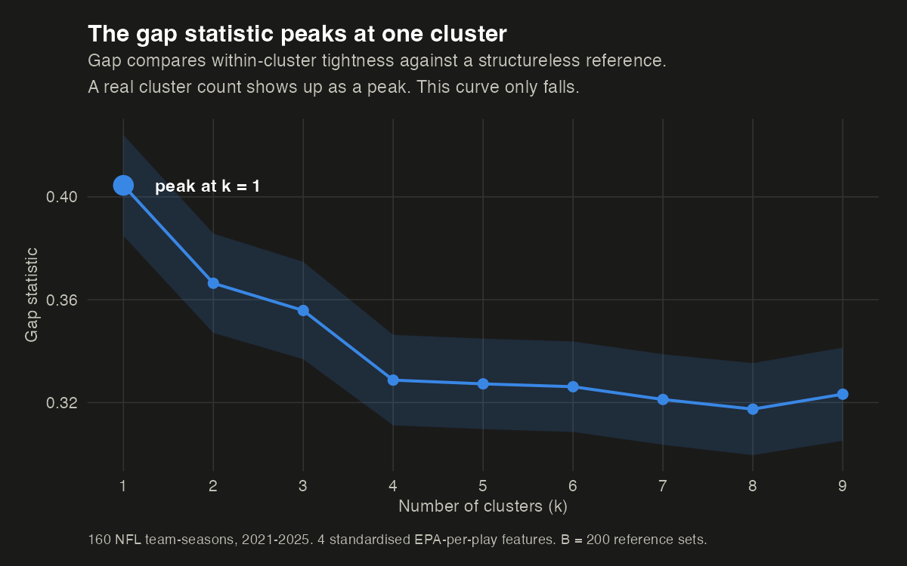
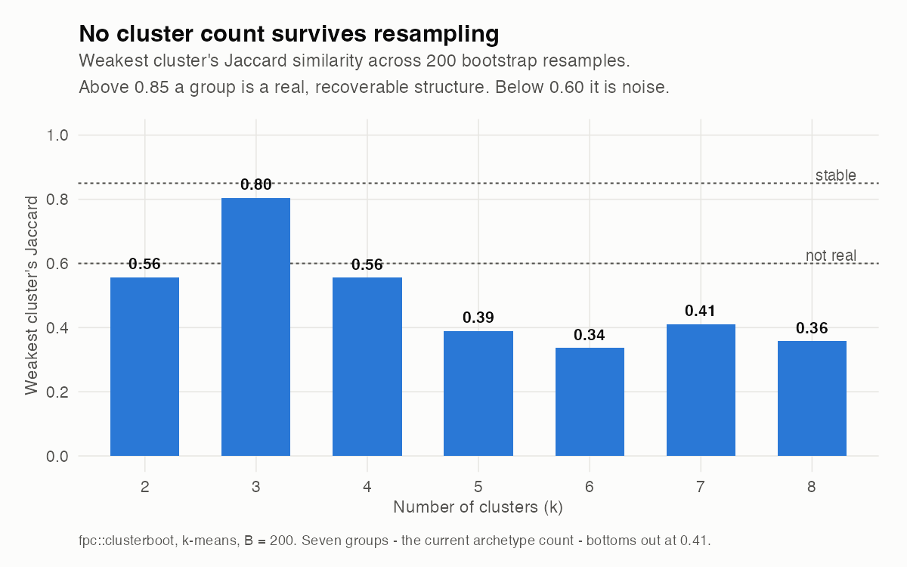
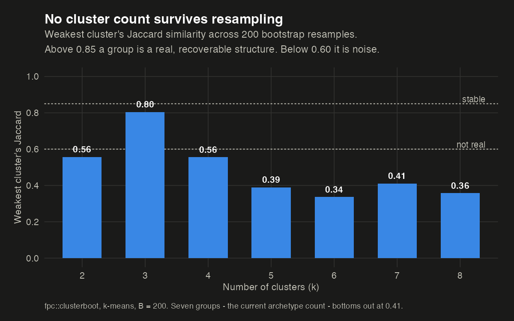
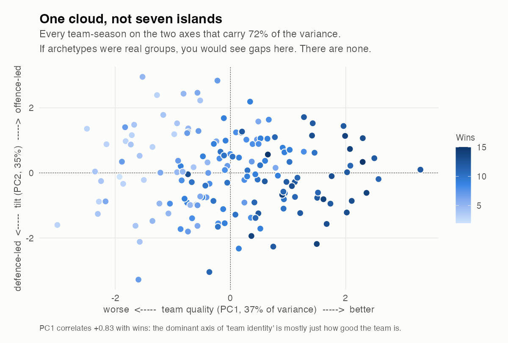
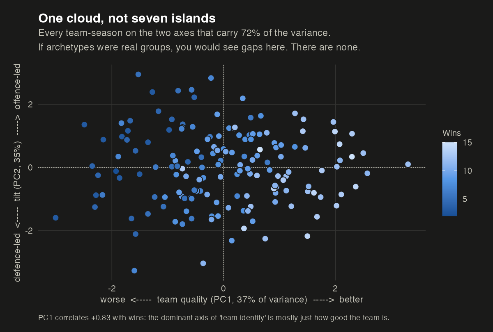

```{=html}
<div class="title-bar">
  <h2>A negative result, reported</h2>
  <p>I set out to replace hand-drawn archetype thresholds with a clustering algorithm. The algorithm refused.</p>
</div>
```

I have a page on this site that sorts all 32 NFL teams into seven archetypes — Contender, Pretender, Rebuilder, and so on. Those labels come from thresholds I drew by hand on quartiles of EPA per play.

That always felt like cheating. The obvious upgrade was to let an algorithm find the groups instead of me drawing them: standardise the efficiency features, run a clustering model, pick *k* honestly, and report the archetypes the data actually contains.

So I did that. Here is what came back.

```{=html}
<div class="verdicts">
  <div class="verdict">
    <div class="v-test">Gaussian mixture (BIC)</div>
    <div class="v-answer">1 component</div>
    <div class="v-note">Across models and 1&ndash;9 components, BIC prefers a single Gaussian.</div>
  </div>
  <div class="verdict">
    <div class="v-test">Gap statistic</div>
    <div class="v-answer">k = 1</div>
    <div class="v-note">Gap peaks at one and falls monotonically after.</div>
  </div>
  <div class="verdict">
    <div class="v-test">Best silhouette</div>
    <div class="v-answer">0.23</div>
    <div class="v-note">Below the 0.25 line conventionally read as "no substantial structure".</div>
  </div>
  <div class="verdict">
    <div class="v-test">Bootstrap stability at k = 7</div>
    <div class="v-answer">0.41</div>
    <div class="v-note">Weakest cluster's Jaccard over 200 resamples. Below 0.6 is noise.</div>
  </div>
</div>
```

---

## The setup

160 team-seasons, 2021 through 2025. Four features, all EPA **per play** so that volume doesn't smuggle itself in as signal, all standardised:

| Feature | What it measures |
|---|---|
| `pass_epa_pp` | Passing offence efficiency |
| `rush_epa_pp` | Rushing offence efficiency |
| `def_pass_pp` | Pass defence, sign-flipped so higher is better |
| `def_rush_pp` | Run defence, sign-flipped so higher is better |

Four tests, each of which is allowed to return "there is nothing here." That last property is the whole point — k-means *always* returns k groups. Ask it for seven and it hands you seven, whether or not seven exist. So the question was never "what do the clusters look like," it was "are there clusters at all."

## Test 1 and 2: how many groups does the data want?

```{=html}
<div class="figpair">
  
  
</div>
<p class="figcap">The gap statistic compares how tight your clusters are against how tight they would be on data with no structure at all. When real groups exist, the curve rises to a peak at the right number. This one starts at its maximum and falls.</p>
```

A Gaussian mixture model fitted over one to nine components, across every covariance structure `mclust` offers, agrees: **BIC selects a single component.** The data is one blob.

## Test 3: does k-means do better than chance?

This is the test I find most convincing, because it controls for the thing people usually forget. Efficiency features are correlated — good passing offences also tend to run well (r = 0.44 here). Correlated data forms an elongated cloud, and k-means will happily slice an elongated cloud into tidy-looking pieces that mean nothing.

So: simulate 200 datasets from a multivariate normal with the *same covariance* as the real data — structureless by construction, but the same shape — and cluster those too.

| k | Real data (within/total SS) | Structureless null | Percentile |
|---|---|---|---|
| 3 | 0.578 | 0.588 | 0.25 |
| 4 | 0.509 | 0.510 | 0.46 |
| 5 | 0.460 | 0.456 | 0.64 |
| 7 | 0.380 | 0.378 | 0.58 |

The real NFL is indistinguishable from a structureless cloud of the same shape. Clustering the actual league does no better than clustering noise.

## Test 4: do the clusters survive resampling?

```{=html}
<div class="figpair">
  
  
</div>
<p class="figcap">If a group is real, resampling the data should recover roughly the same group. Only k = 3 gets close, and even it does not clear the bar. Seven groups &mdash; the count my own archetype system uses &mdash; bottoms out at 0.41.</p>
```

Resample the 160 team-seasons with replacement 200 times, recluster, and measure how much each cluster resembles itself. Above 0.85 you have a real, recoverable structure. Between 0.6 and 0.75 you have a pattern worth mentioning. Below 0.6 you have an artefact of where the algorithm happened to start.

**At seven groups, the weakest cluster scores 0.41.** My archetypes do not survive their own data being resampled.

---

## So what *is* in there?

Four tests said no clusters. That is not the same as saying no structure. Run a PCA and the cloud has a clear shape — it just isn't a lumpy one.

```{=html}
<div class="figpair">
  
  
</div>
<p class="figcap">Two components carry 72% of the variance. This is what a continuum looks like: no gaps, no islands, no natural place to draw a line.</p>
```

Two axes, and only the second one is about identity:

**PC1 (37% of variance) is just quality.** All four features load the same direction, and it correlates **+0.83 with wins**. This is the uncomfortable part: the dominant axis of what I was calling "team identity" is not identity at all. It is how good the team is.

**PC2 (35%) is the real identity axis.** Offence loads positive, defence negative — this separates offence-led teams from defence-led ones. And it correlates just **&minus;0.18 with wins**, meaning it is genuinely orthogonal to quality. Being offence-led is a style. It is not better or worse.

That is the honest map: **one quality axis and one tilt axis.** Not seven boxes.

## The tell I should have noticed earlier

If archetypes were real team properties, they would persist. Teams don't rebuild their identity every September.

| | |
|---|---|
| Teams keeping the same archetype year over year | **33.6%** |
| Chance baseline, given how common each label is | **17.9%** |
| Year-over-year correlation of the quality axis | **0.41** |

So the labels persist about 1.9× better than chance — real, but weak. **Two thirds of teams change archetype every single year.** That is not what a structural property looks like. It is what a label looks like when it mostly encodes quality, and quality regresses to the mean.

---

## What I changed, and what I kept

I did not delete the archetypes. A shallow decision tree fitted to my hand-drawn labels reproduces **85.6%** of them at depth three, which tells you they are at least internally consistent and learnable. They are a **vocabulary** — a compression that makes it faster to talk about a team — and vocabulary is allowed to be imposed.

What I changed is the claim. The [team pages](../../teams/index.qmd) used to present archetypes as discovered structure. They now present them as what they are: labels drawn on a continuum, with every threshold published.

```{=html}
<div class="finding-box">
  <strong>The thing worth taking away:</strong> "no clusters" is a finding, not a
  failed analysis. Had I skipped the four tests and simply run k-means with
  k = 7, I would have got seven clean groups, a lovely coloured scatter plot, and
  a completely fictitious result &mdash; presented with more statistical
  authority than the hand-drawn version it replaced.
</div>
```

The failure mode of clustering is not that it breaks. It is that it never breaks.

```{=html}
<div class="provenance">
  Reproducible: <code>scripts/cluster_archetypes.R</code> in this site's repo runs
  all four tests, the PCA, the persistence check and the decision tree, and writes
  every number quoted above to <code>outputs/cluster_results.json</code>.
  Data: <code>nflreadr</code> play-by-play via the <code>nfl_analytics</code>
  pipeline, 160 team-seasons, 2021&ndash;2025. Seed 42 throughout.
</div>
```

::: {.callout-note}
## The taxonomy itself
The seven archetypes, every threshold behind them, and where they are weakest: [Team Archetypes: How NFL Teams Actually Play](../nfl-team-archetypes/index.qmd).
:::
